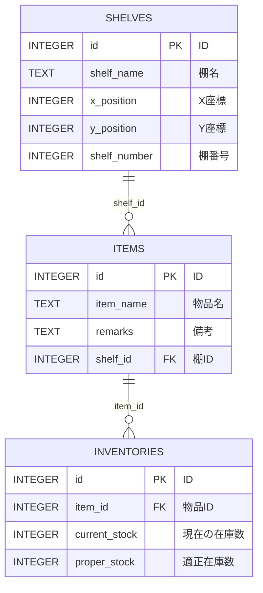
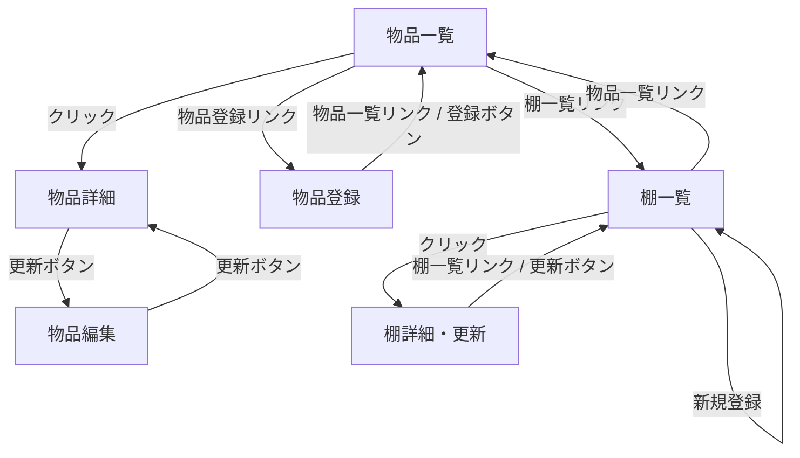

## 概要
このプロジェクトは、倉庫管理システムです。物品、棚、在庫の管理を行います。

## データベース定義
SQLiteを使用しています。以下のテーブルが定義されています。

### テーブル関係図


### 言葉で書くと（後での追記）

- 1つの棚の区画には複数の物を置くことができるし、空にすることもできる
- 1つの物は複数の在庫情報を持つ可能性がある
- 1つの物は1つの区画にしか置けない


### items
| カラム名      | データ型                      | 意味                     |
|---------------|-------------------------------|--------------------------|
| `id`          | INTEGER PRIMARY KEY AUTOINCREMENT | ID                      |
| `item_name`   | TEXT NOT NULL                 | 物品名                   |
| `remarks`     | TEXT                          | 備考                     |
| `shelf_id`    | INTEGER, FOREIGN KEY REFERENCES shelves(id) | 棚ID                    |

### shelves
| カラム名      | データ型                      | 意味                     |
|---------------|-------------------------------|--------------------------|
| `id`          | INTEGER PRIMARY KEY AUTOINCREMENT | ID                      |
| `shelf_name`  | TEXT NOT NULL                 | 棚名                     |
| `x_position`  | INTEGER NOT NULL              | X座標                    |
| `y_position`  | INTEGER NOT NULL              | Y座標                    |
| `shelf_number`| INTEGER NOT NULL              | 棚番号                   |

### inventories
| カラム名      | データ型                      | 意味                     |
|---------------|-------------------------------|--------------------------|
| `id`          | INTEGER PRIMARY KEY AUTOINCREMENT | ID                      |
| `item_id`     | INTEGER NOT NULL, FOREIGN KEY REFERENCES items(id) | 物品ID                   |
| `current_stock`| INTEGER NOT NULL             | 現在の在庫数             |
| `proper_stock`| INTEGER NOT NULL              | 適正在庫数               |

## サーバ側のファイル構造と各ファイルの役割
```
server/
├── db.js                # データベース接続設定
├── index.js             # サーバのエントリーポイント
├── models/
│   ├── itemModel.js     # itemsテーブルの定義
│   ├── shelfModel.js    # shelvesテーブルの定義
│   └── inventoryModel.js# inventoriesテーブルの定義
└── routes/
    ├── itemRoutes.js    # 物品のCRUDルート
    ├── shelfRoutes.js   # 棚のCRUDルート
    └── inventoryRoutes.js# 在庫のCRUDルート
```

### 各ファイルの役割
- `db.js`: SQLiteデータベースへの接続を設定します。
- `index.js`: Expressサーバを起動し、ルートを設定します。
- `models/`: 各テーブルの定義を行います。
- `routes/`: 各エンドポイントのルートを定義します。

## クライアント側のファイル構造と各ファイルの役割
```
client/
├── src/
│   ├── App.js           # アプリケーションのルーティング設定
│   ├── index.js         # Reactのエントリーポイント
│   ├── components/
│   │   ├── ItemList.jsx # 物品一覧表示
│   │   ├── ItemDetail.jsx# 物品詳細表示
│   │   ├── ItemEdit.jsx # 物品編集
│   │   ├── CreateItem.jsx# 物品登録
│   │   ├── ShelfList.jsx# 棚一覧表示
│   │   ├── ShelfDetail.jsx# 棚詳細表示
│   │   └── ShelfEdit.jsx# 棚編集
└── public/
    └── index.html       # HTMLテンプレート
```

### 各ファイルの役割
- `App.js`: React Routerを使用してルーティングを設定します。
- `index.js`: Reactアプリケーションのエントリーポイントです。
- `components/`: 各コンポーネントを定義します。

## 使用技術
- **サーバサイド**: Node.js, Express, SQLite
- **クライアントサイド**: React, React Router

## セットアップ手順
### サーバ側
1. 必要なパッケージをインストールします。
   ```bash
   cd server
   npm install
   ```

2. サーバを起動します。
   ```bash
   node index.js
   ```

### クライアント側
1. 必要なパッケージをインストールします。
   ```bash
   cd client
   npm install
   ```

2. クライアントを起動します。
   ```bash
   npm start
   ```

### データベースのリセット
1. データベースファイルを削除します。
   ```bash
   cd server
   rm warehouse.db
   ```

2. サーバを再起動します。
   ```bash
   node index.js
   ```

## 画面遷移図


これで、新しい環境でアプリケーションをセットアップし、動作させることができます。


